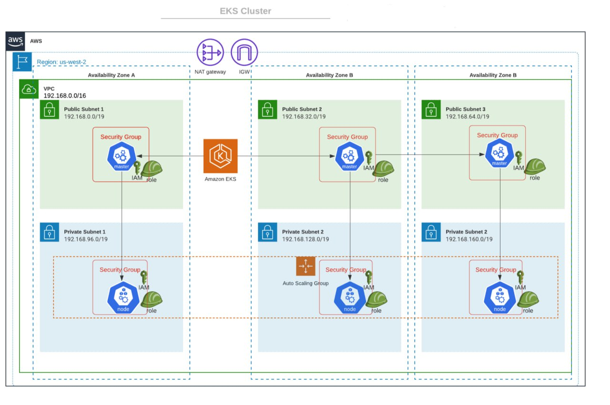
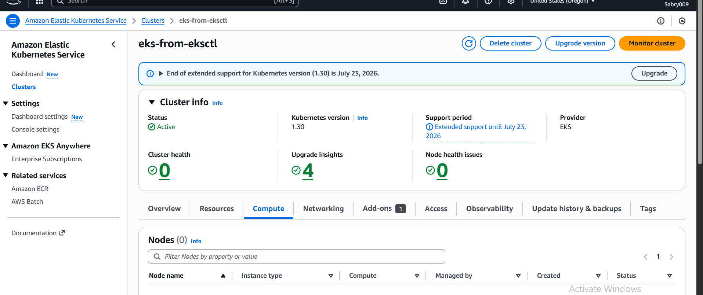

# Install AWS cli
Ref: https://docs.aws.amazon.com/cli/latest/userguide/install-cliv2.html
```bash
curl "https://awscli.amazonaws.com/awscli-exe-linux-x86_64.zip" -o "awscliv2.zip"
unzip awscliv2.zip
sudo ./aws/install


aws --version

# create "default" profile
# aws configure

# create "eks-demo" profile
aws configure --profile eks-demo

aws sts get-caller-identity
```

## Create AWS Profile
In production environment, it's easier to swtich to different AWS IAM user or IAM role identiy by `export AWS_PROFILE=PROFILE_NAME`.

```
vim ~/.aws/credentials
```

[eks-demo] 
aws_access_key_id=YOUR_ACCESS_KEY 
aws_secret_access_key=YOUR_SECRET_ACCESS_KEY
aws_region = YOUR_REGION 


```sh
export AWS_PROFILE=esk-demo

# successful output
aws sts get-caller-identity
{
    "UserId": "xxxxxxxxx",
    "Account": "12321313123131",
    "Arn": "arn:aws:iam::1231231231231:user/eks-demo"
}

```


# Install kubectl
Ref: https://kubernetes.io/docs/tasks/tools/install-kubectl/
```bash
curl -LO "https://dl.k8s.io/release/$(curl -L -s https://dl.k8s.io/release/stable.txt)/bin/linux/amd64/kubectl"
chmod +x kubectl
sudo mv kubectl /usr/local/bin/
kubectl version --client

kubectl version
```

# Install eksctl
Ref: https://docs.aws.amazon.com/eks/latest/userguide/getting-started-eksctl.html
```bash
curl --silent --location "https://github.com/weaveworks/eksctl/releases/latest/download/eksctl_$(uname -s)_amd64.tar.gz" | tar xz -C /tmp
sudo mv /tmp/eksctl /usr/local/bin
eksctl version
```

# Create ssh key for EKS worker nodes
```bash
ssh-keygen
eks_worker_nodes_demo.pem
```

# Setup EKS cluster with eksctl (so you don't need to manually create VPC)
`eksctl` tool will create K8s Control Plane (master nodes, etcd, API server, etc), worker nodes, VPC, Security Groups, Subnets, Routes, Internet Gateway, etc.
```bash
# use official AWS EKS AMI
# dedicated VPC
# EKS not supported in us-west-1

eksctl create cluster \
    --name eks-from-eksctl \
    --version 1.30 \
    --region us-west-2 \
    --nodegroup-name workers \
    --node-type t3.medium \
    --nodes 3 \
    --nodes-min 3 \
    --nodes-max 5 \
    --ssh-access \
    --ssh-public-key /home/sabry/.ssh/eks-demo.pem.pub \
    --managed
```

Output
```bash
[ℹ]  eksctl version 0.21.0
[ℹ]  using region us-west-2
[ℹ]  setting availability zones to [us-west-2b us-west-2a us-west-2c]
[ℹ]  subnets for us-west-2b - public:192.168.0.0/19 private:192.168.96.0/19
[ℹ]  subnets for us-west-2a - public:192.168.32.0/19 private:192.168.128.0/19
[ℹ]  subnets for us-west-2c - public:192.168.64.0/19 private:192.168.160.0/19
[ℹ]  using SSH public key "/Users/USERNAME/.ssh/eks_worker_nodes_demo.pem.pub" as "eksctl-eks-from-eksctl-nodegroup-workers-51:34:9d:9e:0f:87:a5:dc:0c:9f:b9:0c:29:5a:0b:51" 
[ℹ]  using Kubernetes version 1.20
[ℹ]  creating EKS cluster "eks-from-eksctl" in "us-west-2" region with managed nodes
[ℹ]  will create 2 separate CloudFormation stacks for cluster itself and the initial managed nodegroup
[ℹ]  if you encounter any issues, check CloudFormation console or try 'eksctl utils describe-stacks --region=us-west-2 --cluster=eks-from-eksctl'
[ℹ]  CloudWatch logging will not be enabled for cluster "eks-from-eksctl" in "us-west-2"
[ℹ]  you can enable it with 'eksctl utils update-cluster-logging --region=us-west-2 --cluster=eks-from-eksctl'
[ℹ]  Kubernetes API endpoint access will use default of {publicAccess=true, privateAccess=false} for cluster "eks-from-eksctl" in "us-west-2"
[ℹ]  2 sequential tasks: { create cluster control plane "eks-from-eksctl", 2 sequential sub-tasks: { no tasks, create managed nodegroup "workers" } }
[ℹ]  building cluster stack "eksctl-eks-from-eksctl-cluster"
[ℹ]  deploying stack "eksctl-eks-from-eksctl-cluster"
[ℹ]  building managed nodegroup stack "eksctl-eks-from-eksctl-nodegroup-workers"
[ℹ]  deploying stack "eksctl-eks-from-eksctl-nodegroup-workers"
[ℹ]  waiting for the control plane availability...
[✔]  saved kubeconfig as "/Users/USERNAME/.kube/config"
[ℹ]  no tasks
[✔]  all EKS cluster resources for "eks-from-eksctl" have been created
[ℹ]  nodegroup "workers" has 2 node(s)
[ℹ]  node "ip-192-168-20-213.us-west-2.compute.internal" is ready
[ℹ]  node "ip-192-168-39-97.us-west-2.compute.internal" is ready
[ℹ]  waiting for at least 1 node(s) to become ready in "workers"
[ℹ]  nodegroup "workers" has 2 node(s)
[ℹ]  node "ip-192-168-20-213.us-west-2.compute.internal" is ready
[ℹ]  node "ip-192-168-39-97.us-west-2.compute.internal" is ready
[ℹ]  kubectl command should work with "/Users/USERNAME/.kube/config", try 'kubectl get nodes'
[✔]  EKS cluster "eks-from-eksctl" in "us-west-2" region is ready
```

Once you have created a cluster, you will find that cluster credentials were added in ~/.kube/config

```bash
# get info about cluster resources
aws eks describe-cluster --name eks-from-eksctl --region us-west-2
```

Output
```json
{
    "cluster": {
        "name": "eks-from-eksctl",
        "arn": "arn:aws:eks:us-west-2:202536423779:cluster/eks-from-eksctl",
        "createdAt": "2025-11-13T18:48:18.244000+07:00",
        "version": "1.30",
        "endpoint": "https://242F02260C230DA3D2C46D5C9035E46E.sk1.us-west-2.eks.amazonaws.com",
        "roleArn": "arn:aws:iam::202536423779:role/eksctl-eks-from-eksctl-cluster-ServiceRole-NHR5AAVMYKBY",
        "resourcesVpcConfig": {
            "subnetIds": [
                "subnet-0820f91de866118c6",
                "subnet-033da8b1a4e094fd0",
                "subnet-0b2142f44f04cf336",
                "subnet-0cd3179fbb2403217",
                "subnet-079e58ed09df36c91",
                "subnet-0e8ff49f41d33141b"
            ],
            "securityGroupIds": [
                "sg-05e9063cc2cabd063"
            ],
            "clusterSecurityGroupId": "sg-0cf04559e421786da",
            "vpcId": "vpc-07f3adc9189a6baab",
            "endpointPublicAccess": true,
            "endpointPrivateAccess": false,
            "publicAccessCidrs": [
                "0.0.0.0/0"
            ]
        },
        "logging": {
            "clusterLogging": [
                {
                    "types": [
                        "api",
                        "audit",
                        "authenticator",
                        "controllerManager",
                        "scheduler"
                    ],
                    "enabled": false
                }
            ]
        },
        "identity": {
            "oidc": {
                "issuer": "https://oidc.eks.us-west-2.amazonaws.com/id/242F02260C230DA3D2C46D5C9035E46E"
            }
        },
        "status": "ACTIVE",
        "certificateAuthority": {
            "data": "LS0tLS1CRUdJTiBDRVJUSUZJQ0FURS0tLS0tCk1JSUN5RENDQWJDZ0F3SUJBZ0lCQURBTkJna3Foa2lHOXcwQkFRc0ZBREFWTVJNd0VRWURWUVFERXdwcmRXSmwKY201bGRHVnpNQjRYRFRJd01EWXhNekV4TlRZek9Wb1hEVE13TURZeE1URXhOVFl6T1Zvd0ZURVRNQkVHQTFVRQpBeE1LYTNWaVpYSnVaWFJsY3pDQ0FTSXdEUVlKS29aSWh2Y05BUUVCQlFBRGdnRVBBRENDQVFvQ2dnRUJBSlJmCkdKaHFSekhYbkNVVDRNNlQxZmNLKzNRVlVpZDhuMDFxV2RvSlIyRHJvUm9KTTFWUy9Iekc5YTVaUlhYNklLaTcKZUsyeVhzMkxVajErVXl0bGFRaVh5Q1N1Ykxlc3Q2Q2xhRXFBQ2FZNE5DVUNjc2J1WFhlY2JnVEI4cGZlZ2FIUgovMGJFNUhkY1hiSEpzZ0lodmdjMFYxMHhDM2ZhV3lDbDdUTGQ2dkg0Ym5RbktxTjdvU0pDTmtsbVZ4Z3hsajRNCnE1aWV6bW5LakRxUnEyN003bUw2YXNhNlBDWUN2QUZlL05oaFNYcjVaWDRyYjcybUtoQW9Qb0FadFJPMFN1VFgKV1NUVGFkNFpCeXZMZkZIU1FJNzV1QnBoYUtLZTRBUWFpVGxPRHZhMUkyQmc1ejJQeS9yaDRMZXB1RjlMNzNoRApBQjF6R3AvQmdkS2ltMHBIOTVNQ0F3RUFBYU1qTUNFd0RnWURWUjBQQVFIL0JBUURBZ0trTUE4R0ExVWRFd0VCCi93UUZNQU1CQWY4d0RRWUpLb1pJaHZjTkFRRUxCUUFEZ2dFQkFJTzhrQlBHQTYyK2ZJYzhGcjNEUE96Nk9VclEKYjc1dmR4VS9xQUxJSGJxRk1SZ3NIOHkvWERmK2Y3TEI3QndiU1BUWTZraExPT2xPV3ByRzI3cFdnVGgrK2E4NApieUJIU0xMbWhFZFAzZHFuVzVyS3piNVovdGF0S2lJZGFyQTZwQlhOR2lLWFZWaStMTmJLeVNhVGdVbXhIVUpoCjZuSno5TXA2MFBMcDk4ZkJzVnROejhxZXFkelZrUFd4d1FRUWFLZ1hqdUNDakU2cjhvQmZmSnVkVGpMUmxwWkoKT292cGFPRU9RRlcvRzBGM1lOQ2FiRFpnSmhUcGZSSnVmRkd4MkdoV1pFOGQ4TWJyUko2aExPZGswOTFFSTIwLwpJWUtHYklvZFhPMUIydGQ4eWRDOWh5M1RHOEhaekxMMUNxK3QxdGNQVmsxL0tMRXVwc1NLcGFocE5HWT0KLS0tLS1FTkQgQ0VSVElGSUNBVEUtLS0tLQo="
        },
        "platformVersion": "eks.1",
        "tags": {}
    }
}
```

```bash
# get services
kubectl get svc
```

Output shows the default `kubernetes` service, which is the API server in master node
```bash
NAME         TYPE        CLUSTER-IP   EXTERNAL-IP   PORT(S)   AGE
kubernetes   ClusterIP   10.100.0.1   <none>        443/TCP   38m
```

# AWS Networking Basics Overview - Region, AZ, VPC and Subnet


Master (AWS manages this, hence master nodes not visible in Console):
- three master nodes for HA
- security group for masters
- IAM role and instance profile for master nodes

Worker:
- arbitrary # of worker nodes
- auto scaling group (ASG)
- launch config for ASG (launch config is a template for ASG)
- security group for workers
- IAM role and instance profile for workers

AWS VPC:
- VPC
- Subnets for three availability zones (AZ) for us-west-2 region
- Route tables with routes
- Internet Gateway
- NAT gateway

Shared responsibility model for EKS 


# EKS Console
